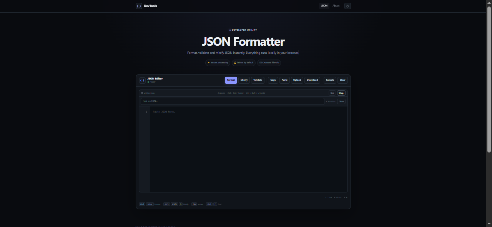

# JSON Developer Toolkit

A lightweight browser-based JSON toolkit for formatting, validating, minifying, searching, and working with JSON.

Built by **AditDev** using HTML, CSS, and Vanilla JavaScript.

## Live Demo

https://aditdev-json-toolkit.pages.dev/json-toolkit.html

## Product

The complete developer toolkit is available as a digital product:

https://payhip.com/b/KGea3

## Features

- Format JSON
- Validate JSON
- Minify JSON
- Search JSON content
- Upload JSON files
- Drag and drop files
- Download JSON
- Copy JSON
- Syntax highlighting
- Line numbers
- JSON statistics
- Keyboard shortcuts
- Responsive desktop and mobile interface

## Screenshot



## Built With

- HTML
- CSS
- Vanilla JavaScript

No frontend framework is required.

## How It Works

JSON processing is performed directly in the browser.

The main toolkit does not require:

- A backend server
- A database
- API keys
- Package installation

This keeps the tool lightweight and easy to run.

## Running Locally

Clone the repository:

```bash
https://github.com/aditdev01/json-formatter.git
